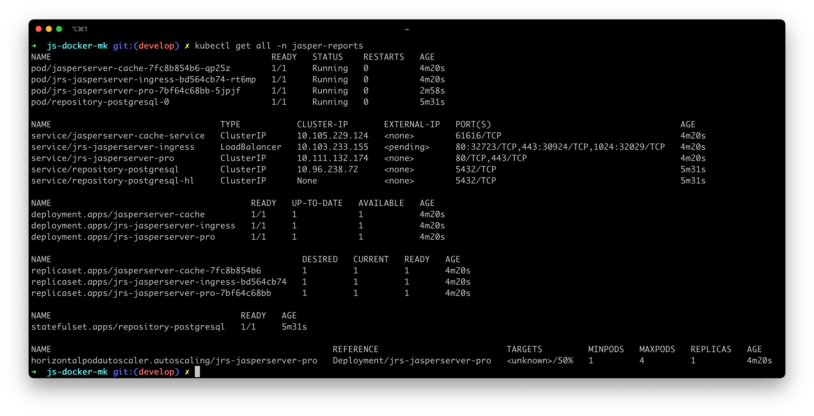

# TIBCO JasperReports® Server for minikube
This repository is a fork of the [TIBCOSoftware/js-docker](https://github.com/TIBCOSoftware/js-docker) repository.

This project intends to build and deploy a minimal TIBCO JasperReports® Server Professional Edition installation to a local Kubernetes cluster using [minikube](https://github.com/kubernetes/minikube).



This project contains a bash script that aims to codify the steps found in the base repo docs here:
- [Use Case: Deploying TIBCO JasperReports® Server Using PostgreSQL Container in K8s Cluster](./jaspersoft-containers/K8s/jrs/README.md#use-case-deploying-tibco-jasperreports-server-using-postgresql-container-in-k8s-cluster)

<br>

# Prerequisites

1. [Docker-engine (19.x+)](https://docs.docker.com/engine/install/)
1. [minikube](https://minikube.sigs.k8s.io/docs/start/) 
1. [Docker Compose  (3.9+)](https://docs.docker.com/compose/install/)
1. [Helm 3.5](https://helm.sh/docs/intro/)
1. [kubectl commandline tool](https://kubernetes.io/docs/tasks/tools/)
1. TIBCO JasperReports&reg; Server
1. Minimal Knowledge of Docker and K8s

# Setup
Clone the project
```
git clone git@github.com:pdeters/js-docker-mk.git
cd js-docker-mk
```
Download a commercial edition of TIBCO JasperReports® Server WAR File installer zip into the current directory. 
- _Currently this works for exactly_ `TIB_js-jrs_8.1.0_bin.zip`


Obtain a JRS license file and place it in the current directory as `jasperserver.license`

# Run
**Run the default setup script:**
```
  sh minikube/setup.sh
```
     
This script will delete and recreate minikube, create and customize necessary files in the base repository and unzipped installer directories, then build and deploy the Docker images to minikube using Docker Compose and Helm.

<br>

**Run the default setup script, accepting all prompts:**

The default setup script will prompt you before doing anything destructive (such as running `minikube delete`), but you can skip these prompots using the `-f` flag:
```
  sh minikube/setup.sh -f
```

<br>

**Run the setup script, with a custom k8s namespace:**

By default this script will install all k8s resources in the `jasper-reports` namespace, but you may also provide your own using the `-n` flag:
```
  sh minikube/setup.sh -n custom-namespace
```

<br>

**Run the cleanup script:**

By design this script aims to not modify any of the asset files in the base repository, so once the script has completed you should expect to see several modified and untracked files (aside from the zip and license files you initially [setup](#Setup)).

It's not reccomened to commit these changes, so after the setup script completes, you can run it again to cleanup using the `-c` flag:
```
  sh minikube/setup.sh -c
```
