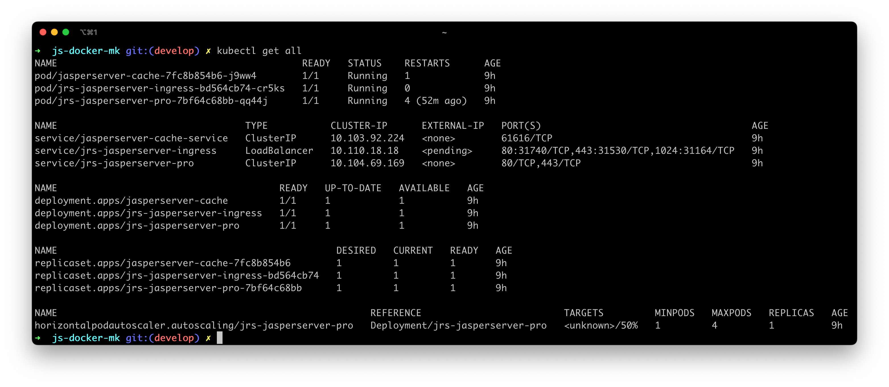

# TIBCO JasperReports® Server for minikube
This repository is a fork of the [js-docker](https://github.com/TIBCOSoftware/js-docker) repository.

This project intends to build and deploy a minimal TIBCO JasperReports® Server Professional Edition installation to a local Kubernetes cluster using [minikube](https://github.com/kubernetes/minikube).

