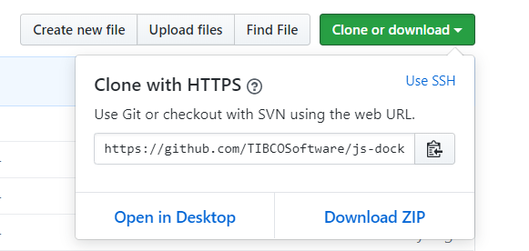

# TIBCO  JasperReports&reg; Server for Docker

# Table of contents

1. [Introduction](#introduction)
1. [Prerequisites](#prerequisites)
1. [Installation](#installation)
   1. [Get the JaspeReports Server Docker configuration](#get-the-js-docker-dockerfile-and-supporting-resources)
   1. [Repository structure](#the-installed-repository-structure)
   1. [Get the JasperReports Server WAR file installer](#get-the-jasperreports-server-war-file-installer)
1. [docker build time environment variables](#docker-build-time-environment-variables)
1. [docker run time environment variables](#docker-run-time-environment-variables)
1. [Configuring JasperReports Server with volumes](#configuring-jasperreports-server-with-volumes)
   1. [Using data volumes](#using-data-volumes)
   1. [JasperReports Server use of volumes](#jasperreports-server-use-of-volumes)
   1. [Setting volumes](#setting-volumes)
   1. [Paths to data volumes on Mac and Windows](#paths-to-data-volumes-on-mac-and-windows)
1. [Build and run](#build-and-run)
   1. [Building and running with docker-compose](#building-and-running-with-docker-compose)
   1. [Using a pre-existing PostgreSQL database in Docker](#using-a-pre-existing-postgresql-instance-in-docker)
   1. [Creating a new PostgreSQL database](#creating-a-new-postgresql-database)
1. [Initializing the JasperReport Server Repository](#initializing-the-jasperreport-server-repository)
1. [Import content into the JasperReports Server repository](#importing-to-a-jasperreports-server-repository)
1. [Export from the JasperReports Server repository](#exporting-from-a-jasperreports-server-repository)
1. [JasperReports Server logs](#jasperreports-server-logs)
1. [Logging in to JasperReports Server](#logging-in-to-jasperreports-server)
1. [Troubleshooting](#troubleshooting)
   1. [Unable to download phantomjs](#unable-to-download-phantomjs)
   1. ["No route to host" error on a VPN/network with mask](#-no-route-to-host-error-on-a-vpn-or-network-with-mask)
   1. [`docker volume inspect` returns incorrect paths on MacOS X](#-docker-volume-inspect-returns-incorrect-paths-on-macos-x)
   1. [`docker-compose up` fails with permissions error](#-docker-compose-up-fails-with-permissions-error)
   1. [Connection to repository database fails](#connection-to-repository-database-fails)
1. [Docker documentation](#docker-documentation)

# Introduction

This distribution includes a sample `Dockerfile` and 
supporting files for
building, configuring, and running
TIBCO JasperReports&reg; Server
in a Docker container.  This sample can be used as is 
or modified to meet the needs of your environment. 
The distribution can be downloaded from 
[https://github.com/TIBCOSoftware/js-docker](#https://github.com/TIBCOSoftware/js-docker).

This configuration has been certified using
the PostgreSQL 9 database with JasperReports Server 6.4+
and with PostgreSQL 10 for JasperReports Server 7.2+

Basic knowledge of Docker and the underlying infrastructure is required.
For more information about Docker see the
[official documentation for Docker](https://docs.docker.com/).

For more information about JasperReports Server, see the
[Jaspersoft community](http://community.jaspersoft.com/).

# Prerequisites

The following software is required or recommended:

- [docker-engine](https://docs.docker.com/engine/installation) version 1.12 or higher
- (*recommended*):
  - [Docker Desktop for Windows](https://docs.docker.com/docker-for-windows/install/)
  - [Docker Desktop for Mac](https://docs.docker.com/docker-for-mac/install/)
- (*recommended*) [docker-compose](https://docs.docker.com/compose/install) version 1.12 or higher
- (*optional*) [git](https://git-scm.com/downloads)
- (*optional*) TIBCO Jaspersoft&reg; commercial license.
- Contact your sales
representative for information about licensing. If you do not specify a
TIBCO Jaspersoft license, the evaluation license is used.
- (*optional*) Preconfigured PostgreSQL, MySQL, Oracle, SQL Server or DB2 database. If you do not
currently have a database instance, you can create a database container
at deployment time.

# Installation

## Get the js-docker Dockerfile and supporting resources

Download the js-docker repository as a zip and unzip it, or clone the repository from Github.

To download a zip of js-docker:
- Go to [https://github.com/TIBCOSoftware/js-docker](https://github.com/TIBCOSoftware/js-docker)
- Select Download ZIP on the right hand side of the screen.


Select Open in Desktop if you have a Git Desktop installed. This will clone the repository for you.
 
If you have the Git command line installed, you can clone the JasperReports Server Docker github repository at 
[https://github.com/TIBCOSoftware/js-docker](https://github.com/TIBCOSoftware/js-docker):

```console
$ git clone https://github.com/TIBCOSoftware/js-docker
$ cd js-docker
```

## The installed Repository structure

The js-docker github repository contains:

- `Dockerfile` - container build commands
- `docker-compose.yml` - sample configuration for building and running via
docker-compose
- `.env` - sample file with environment variables for docker-compose
- `README.md` - this document
- `resources\` - directory where you put your JasperReports Server zip file
or other files you want to copy to the container
  - `README.md` - short description of `resources` structure
- `scripts\`
  - `entrypoint.sh` - sample runtime configuration for starting and running
JasperReports Server from the shell
- `kubernetes` - directory of JasperReports Server Kubernetes configuration [https://github.com/TIBCOSoftware/js-docker/kubernetes](https://github.com/TIBCOSoftware/js-docker/kubernetes)


## Get the JasperReports Server WAR file installer

Download the JasperReports Server WAR File installer zip archive from the TIBCO eDelivery
or build it from a bundled installer [Jaspersoft WAR File Installer builder](buildWARFileInstaller)

Copy the installer zip file to the `resources` directory in the repository structure.
For example, if you have downloaded the zip to your ~/Downloads directory:

```console
$ cp ~/Downloads/TIB_js-jrs_X.X.X_bin.zip resources/
```

# docker build time environment variables
These can be passed on the command line with -e, in an env-file, docker-compose.yml, Kubernetes etc.

Environment Variable Name | Notes |
------------ | ------------- |
`HTTPS_PORT` | Defaults to 8443 |
`HTTP_PORT` | Defaults to 8080. Cannot be overridden |
`JAVA_OPTS` | command line options passed to OpenJDK 8 / Tomcat 9 |
`POSTGRES_JDBC_DRIVER_VERSION` | defaults to 42.2.5. If you change this in the Dockerfile, the new version will be downloaded from https://jdbc.postgresql.org/download.html |
 | |
 | A self signed SSL certificate is configured for the Tomcat environment. |
`DN_HOSTNAME` | self signed certificate host name. Defaults to "localhost.localdomain" |
`KS_PASSWORD` | default keystore password. Defaults to "changeit" |
`JRS_HTTPS_ONLY` | Enables HTTPS-only mode. Default to false. | 

# docker run time environment variables
These can be passed on the command line with -e, in an env-file, docker-compose.yml, Kubernetes etc.

If the `DB_NAME` repository database does not exist in the configured Postgresql database, entrypoint.sh will create it.

Environment Variable Name | Notes |
------------ | ------------- |
`DB_TYPE` | valid dbTypes are: postgresql, mysql, sqlserver, oracle, db2. default to postgresql. |
`DB_HOST` | database host IP or domain name. defaults to postgres |
`DB_PORT` | database port. if not set, JasperReports Server will use the default port for the dbType |
`DB_USER` | database username. defaults to postgres |
`DB_PASSWORD` | database password. defaults to postgres |
`DB_NAME` | JasperReports Server repository schema name in the database. defaults to jasperserver |
`JDBC_DRIVER_VERSION` | optional. for non-PostgreSQL databases. Requires a JDBC driver with the required version accessible through a volume. See [Use of Volumes](#jasperreports-server-use-of-volumes)  |
`POSTGRES_JDBC_DRIVER_VERSION` | optional, defaults to 42.2.5. If you change this, the new version will need to be installed by volume as above. See [Use of Volumes](#jasperreports-server-use-of-volumes) |
`JRS_LOAD_SAMPLES` | Load JasperReports Server samples when creating the database. defaults to false | 
 | |
`HTTPS_PORT` | Defaults to 8443 | 
`HTTP_PORT` | Defaults to 8080. Cannot be overridden | 
`JAVA_OPTS` | command line options passed to OpenJDK 8 / Tomcat 9 | 
`JRS_DBCONFIG_REGEN` | Forces updates to the repository JNDI database configuration plus the JDBC driver in tomcat/lib. Defaults to false. |
 | |
 | Only used if a keystore is being overridden through a new keystore.  See new keystore addition through volumes below. |
`KS_PASSWORD` | default keystore password. Defaults to "changeit" |
`JRS_HTTPS_ONLY` | Enables HTTPS-only mode. Default to false. |
 | |
 If you are running Postgresql in a container via docker-compose: | If these variables are not set, PostgreSQL will be launched with no access restrictions. |
`POSTGRES_PASSWORD` | |
`POSTGRES_USER` | |


# Configuring JasperReports Server with volumes

## Using data volumes

Docker, Kubernetes and Docker compose best practices recommend the use of
[data volumes](https://docs.docker.com/engine/tutorials/dockervolumes/) for managing
persistent data and configurations. The type and setup of data volumes depend
on your infrastructure. We provide sensible defaults for a basic
docker installation.

Note that the data in data volumes is not removed with the container and needs
to be removed separately. Changing or sharing data in  the default
data volume while the container is running is not recommended. To share a
volume, use [volume plugins](
https://docs.docker.com/engine/extend/plugins/). See the Docker
[documentation](https://docs.docker.com/engine/tutorials/dockervolumes/#/important-tips-on-using-shared-volumes)
for more information.

## JasperReports Server use of volumes

Description | Path to override in container | Notes |
------------ | ------------- | ------------ |
Complete JasperReports Server web application | `${CATALINA_HOME}/webapps/jasperserver-pro` | The complete JasperReport Server WAR structure in the external volume |
License | `/usr/local/share/jasperreports-pro/license` | Path to contain jasperserver.license file to use. If not provided, a temporary license is used. |
JasperReports Server customizations | `/usr/local/share/jasperreports-pro/customization` | Volume to contain zip files that are unzipped into `${CATALINA_HOME}/webapps/jasperserver-pro`. Files are processed in alphabetical order, so duplicate file names can be overridden. | 
Tomcat level customizations | `/usr/local/share/jasperserver-pro/tomcat-customization` | Volume to contain zip files that are unzipped into `${CATALINA_HOME}`. Files are processed in alphabetical order, so duplicate file names can be overridden. |
New keystore file | `/usr/local/share/jasperserver-pro/keystore` | .keystore files in this volume loaded into /root. The keystore password must be set as the KS_PASSWORD environment variable.|
 Additional default_master installation properties | `/usr/local/share/jasperserver-pro/deploy-customization` |  `default_master_additional.properties` file contents appended to default_master.properties. See "To install the WAR file using js-install scripts" in JasperReports Server Installation Guide |
| Include a new version of a JDBC driver for the repository database | /usr/src/jasperreports-server/buildomatic/conf_source/db/<dbType>/jdbc | valid dbTypes are: postgresql, mysql, sqlserver, oracle, db2. Need to set the `JDBC_DRIVER_VERSION` environment variable to the version number of the driver. |

## Setting volumes

`docker run -v external_volume:<path to override in container>`

docker-compose:

```
   volumes:
      - jrs_license:/usr/local/share/jasperreports-pro/license 
```

If you update the files in a volume listed above, you will need to restart the container, as these are only processed at container start time.

### Paths to data volumes on Mac and Windows

You can mount a volume to a directory on your local machine.
For example, to access a license on a local directory on Mac:

```console
docker run --name new-jrs
-v /<path>/resources/license:/usr/local/share/jasperreports-pro/license 
-p 8080:8080 -e DB_HOST=172.17.10.182 -e DB_USER=postgres -e 
DB_PASSWORD=postgres -d jasperserver-pro:X.X.X
```

Volumes in Docker for Windows need to be under the logged in user's User area ie.

```console
volumes:
	- /C/Users/<user>/Documents/License:/usr/local/share/jasperserver-pro/license 
```

Windows paths need some help with a Docker Compose environment setting:

```console
COMPOSE_CONVERT_WINDOWS_PATHS=1
```

# Build and run

## Building and running with docker-compose

`docker-compose.yml` provides a sample
[Compose](https://docs.docker.com/compose/compose-file/) implementation of
JasperReports Server with PostgreSQL server, configured with volumes for
JasperReports Server web application and license, with pre-setup network and
mapped ports. There is also a pre-configured `.env` file for use with
docker-compose.

To build and run using `docker-compose.yml`, execute the following commands in
the root directory of your repository:

```console
$ docker-compose build
$ docker-compose up -d
```

## Using a pre-existing database

To build and run a JasperReports Server container with a pre-existing
PostgreSQL instance, execute these commands in your repository:

```console
$ docker build -t jasperserver-pro:X.X.X .
$ docker run --name some-jasperserver -p 8080:8080 \
-e DB_HOST=some-external-host -e DB_USER=username \
-e DB_PASSWORD=password -d jasperserver-pro:X.X.X
```

Where:

- `jasperserver-pro:X.X.X` is the image name and version tag
for your build. This image will be used to create containers.
- `some-jasperserver` is the name of the new JasperReports Server container.
- `some-external-host` is the hostname, fully qualified domain name
(FQDN), or IP address of your database server.
-  `username` and `password` are the user credentials for your PostgreSQL
server.

## Creating a new PostgreSQL database in Docker

To build and run JasperReports Server with a new database container
you can use linking:

```console
$ docker run --name some-postgres -e POSTGRES_USER=username \
-e POSTGRES_PASSWORD=password -d postgres:10
$ docker build -t jasperserver-pro:X.X.X .
$ docker run --name some-jasperserver --link some-postgres:postgres \
-p 8080:8080 -e DB_HOST=some-postgres -e DB_USER=db_username \
-e DB_PASSWORD=db_password -d jasperserver-pro:X.X.X
```

Where:

- `some-postgres` is the name of your new database container.
- `username` and `password` are the user credentials to use for the
new PostgreSQL container and JasperReports Server container.
- `postgres:10` [PostgreSQL 10](https://hub.docker.com/_/postgres/) is
the PostgreSQL image from Docker Hub. This can be replaced with other
database types that match the dbType environment variable.
- `jasperserver-pro:X.X.X` is the image name and version tag
for your build. This image will be used to create containers.
- `some-jasperserver` is the name of the new JasperReports Server container.
-  `db_username` and `db_password` are the user credentials for accessing
the database server. Database settings should be modified for your setup.

You can do the same with MySQL, Oracle, SQL Server and DB2.

The `docker-compose.yml` shows how to launch Jasperreports Server automatically
with a PostgreSQL repository running in Docker. By default, this `docker-compose.yml`
uses the `.env` file for configuration purposes. There is also a `.env-mysql` to
show how an external MySQL database running on the default 3306 port
can be used as a repository.

# Initializing the JasperReport Server Repository

Set the dbType and DB_\* environment variables as outlined above. The default command
of the container - `run` - will detect whether the repository host exists and
can be connected to, and whether the repository database exists in the host, and
create them as needed. The `JRS_LOAD_SAMPLES` environment variable can be set to `true` to load the
JasperReports Server samples and their underlying databases into the repoitory database.

Also there is the standalone `init` command for the image that allows you to pre-create
the repository database and samples.

```
docker run --rm \
  --env-file .env -e DB_HOST=jasperserver_pro_repository  \
  --name jasperserver-pro-init \
  jasperserver-pro:X.X.X init 
```

The JasperReports Server samples can be loaded via the `init` command without
setting the `JRS_LOAD_SAMPLES` environment variable. Add `samples` as a parameters
to the `init` command as follows:

```
docker run --rm \
  --env-file .env -e DB_HOST=jasperserver_pro_repository  \
  --name jasperserver-pro-init \
  jasperserver-pro:X.X.X init samples
```

# Import and Export

One maintenance aspect of the JasperReports Server is exporting and importing
content - reports, domains and other metadata - with the repository. The Docker entrypoint.sh
has commands to allow you to run the JasperReports Server image to do imports and exports
directly to a JasperReports Server repository database, leveraging the JRS command line
js-export and js-import tools, documented in the `JasperReports Server Administration Guide`.
See [Jaspersoft Documentation](https://community.jaspersoft.com/documentation)
and search for "Administration" in the page to get the latest.

## Exporting to a JasperReports Server repository

1. Create an 'export.properties' file in a directory, with each line containing parameters
for individual imports: zip files and/or directories. See the JasperReports Server
Administration Guide - section: "Exporting from the Command Line" for the options.

```
# Comment lines are ignored, as are empty lines

# Server settings
--output-zip BS-server-settings-export.zip

# Repository export
--output-zip Bikeshare-JRS-export.zip

# Repository export
--output-dir some-sub-directory

# Organization export. Org has to be created before running this import
--output-zip Bikeshare_org_user_export.zip --organization Bikeshare
```

1. Run the JasperReports Server image with the export command,
defining and passing into the command in one or more volumes
where the `export.properties` is and the exports are to be stored.

And do either:
  1. Use existing database running in Docker. Note the network and DB_HOST settings.
  ```
  docker run --rm \
    -v /path/to/a/volume:/usr/local/share/jasperserver-pro/export \
    --network js-docker_default -e DB_HOST=jasperserver_pro_repository  \
	--name jasperserver-pro-export \
	jasperserver-pro:X.X.X export /usr/local/share/jasperserver-pro/export
  ```
  1. Use an external repository database. Note the DB_HOST setting.
  ```
  docker run --rm \
    -v /path/to/a/volume:/usr/local/share/jasperserver-pro/import \
    -e DB_HOST=domain.or.IP.where.repository.database.is  \
    --name jasperserver-export \
    jasperserver-pro:X.X.X export /usr/local/share/jasperserver-pro/import
  ```
  
After an export run, the export.properties file is renamed in the volume as `export-done.properties`.

## Importing to a JasperReports Server repository

1. Create an 'import.properties' file in a directory, with each line containing parameters
for individual imports from export zip files and/or directories. See the JasperReports Server
Administration Guide - section: "Importing from the Command Line" for the options.

```
# Comment lines are ignored, as are empty lines

# Server settings
--input-zip BS-server-settings-export.zip

# Repository import
--input-zip Bikeshare-JRS-export.zip

# Import from a directory
--input-dir some-sub-directory

# Organization import. Org has to be created before running this import
--input-zip Bikeshare_org_user_export.zip --organization Bikeshare
```

1. Place the ZIP files and/or directories into the same directory as the
`import.properties`.

1. Run the JasperReports Server image, defining and passing into the command
one or more volumes where the import.properties
and the exports are stored.

And do either:

  1. Use a database instance running in Docker. Note the network and DB_HOST settings.
  ```
  docker run --rm \
    -v /path/to/a/volume:/usr/local/share/jasperserver-pro/import \
	--network js-docker_default -e DB_HOST=jasperserver_pro_repository  \
	--name jasperserver-pro-import \
	jasperserver-pro:X.X.X import /usr/local/share/jasperserver-pro/import
  ```
  1. Use an external repository database. Note the DB_HOST setting.
  ```
  docker run --rm \
    -v /path/to/a/volume:/usr/local/share/jasperserver-pro/import \
	-e DB_HOST=domain.or.IP.where.database.is  \
	--name jasperserver-import \
	jasperserver-pro:X.X.X import /usr/local/share/jasperserver-pro/import
  ```
  
After an import run, the import.properties file is renamed in the volume as `import-done.properties`.

Note that, as of JasperReports 7.2.0 at least, there is no way to import a organization
export.zip at the highest level (root) without first creating the organization via the
JasperReports Server user interface or REST.
  
# JasperReports Server logs

By default, the JasperReports Server log is streamed to the console,
so default Docker logging can pick that up.

Beyond the console. there are multiple options for log access, aggregation, and management
in the Docker ecosystem. The most common options are:

- volumizing log files
- using docker [logging drivers](
https://docs.docker.com/engine/admin/logging/overview/)

For the TIBCO JasperReports Server Docker, the default `json-file`
docker drivers should be sufficient.
In a more complex environment a log collector should be considered. One
example is collecting logs on a remote syslog server.
See the
[logging drivers](https://docs.docker.com/engine/admin/logging/overview/)
documentation for
more information.

To volumize the JasperReports Server container log, you can create a container
for log storage:

```console
$ docker volume create --name some-jasperserver-log
$ docker run --name some-jasperserver -v \
some-jasperserver-log:/usr/local/tomcat/webapps/jasperserver-pro/WEB-INF/logs \
-p 8080:8080 -e DB_HOST=172.17.10.182 -e DB_USER=postgres \
-e DB_PASSWORD=postgres -d jasperserver-pro:X.X.X
```
Where:

- `some-jasperserver-log` is the name of the new data volume for log storage.
- `some-jasperserver` is the name of the new JasperReports Server container
- `jasperserver-pro:X.X.X`  is the image name and version tag.
for your build. This image will be used to create containers.
- Database settings should be modified for your setup.

Note that docker containers do not have separate logs. All information is
logged via the driver or application. In the case of the JasperReports
Server container, the main log is output by Tomcat to the docker-engine
via the logging driver, and the application log specific to
JasperReports Server is output to
`some-jasperserver-log:/usr/local/tomcat/webapps/jasperserver-pro/WEB-INF/logs`

## Logging in to JasperReports Server 

After the JasperReports Server container is up, log into it via URL.
The URL depends upon your installation. The default configuration uses:

```
http://localhost:8080/jasperserver-pro
```

Where:

- localhost is the name or IP address of the computer hosting JasperReports Server.
- 8080 is the port number for the Apache Tomcat application server. 
If you used a different port when installing your application server, 
specify its port number instead of 8080.

JasperReports Server ships with the following default credentials:

- superuser/superuser - System-wide administrator
- jasperadmin/jasperadmin - Administrator for the default organization

# Troubleshooting

## Unable to download phantomjs
At build-time Docker fails with an error "403: Forbidden" when downloading
phantomjs:

```
2016-09-19 20:54:50 ERROR 403: Forbidden.
```

This occurs when the phantomjs binary is temporarily unavailable for download.
You can do one of the following: disable the phantomjs download, change the
URL, or use a locally-downloaded phantomjs archive. See `Dockerfile` for
details. Note that if you had a successful build and the Docker cache has not
been invalidated,
you do not need to re-download phantomjs on a subsequent build.

## "No route to host" error on a VPN or network with mask

The default Docker network may conflict with your VPN space.
Change to a different CIDR for the Docker network using `--bip`.
See the [Docker networking documentation](
https://docs.docker.com/v1.8/articles/networking/#docker0)
for more information; for Mac, also see
[Docker issue 25064](#https://github.com/docker/docker/issues/25064).

## `docker volume inspect` returns incorrect paths on MacOS X

Due to the nature of [Docker for Mac](
https://docs.docker.com/engine/installation/mac/#/docker-for-mac)
 `docker volume inspect` returns paths that are relative to the main docker
process. You must either access the path in the container, for example,
`/var/lib/docker/volumes/some-jasperserver-license/_data`,
or define a volume path instead of a named volume.
This also applies to Docker Compose.
See [Using data volumes](#using-data-volumes) for defining a local path.
For more information see Docker Community Forums: [Host path of volume](
https://forums.docker.com/t/host-path-of-volume/12277/6)

## Connection to repository database fails

The entrypoint.sh tries to connect to the repository database before starting
the Server. If there are problems, there will be 5 retries to connect before
stopping the process. You can see the problem in the JasperReports Server
container log.

```
PS C:\Users\user\Documents\GitHub\js-docker> docker run --rm --env-file .env-mysql
--name jrs-init-test -v /C/Users/user/Documents/Docker/buildomatic/mysql/jdbc:/usr/src/jasperreports-server/buildomatic/conf_source/db/mysql/jdbc
jasperserver-pro:X.X.X init
     [exec] Execute failed: java.io.IOException: Cannot run program "git": error=2, No such file or directory

BUILD FAILED
/usr/src/jasperreports-server/buildomatic/bin/validation.xml:493: The following error occurred while executing this line:
/usr/src/jasperreports-server/buildomatic/bin/validation.xml:374: The following error occurred while executing this line:
/usr/src/jasperreports-server/buildomatic/conf_source/db/mysql/db.xml:73: The following error occurred while executing this line:
/usr/src/jasperreports-server/buildomatic/bin/validation.xml:411: The following error occurred while executing this line:
/usr/src/jasperreports-server/buildomatic/bin/validation.xml:468: Invalid username/password combination: [jaspersoftX/jaspersoft].
 Treating problem with JDBC connection as unrecoverable

Total time: 0 seconds
saw 0 OK connections, not at least 1
test_connection returned fail
```

You will need to review the network connection between the Server and the database
instance, and review DB_\* environment settings.

# Docker documentation
For additional questions regarding docker and docker-compose usage see:
- [docker-engine](https://docs.docker.com/engine/installation) documentation
- [docker-compose](https://docs.docker.com/compose/overview/) documentation

# Copyright
Copyright &copy; 2019. TIBCO Software Inc.
This file is subject to the license terms contained
in the license file that is distributed with this file.
___

TIBCO, Jaspersoft, and JasperReports are trademarks or
registered trademarks of TIBCO Software Inc.
in the United States and/or other countries.

Docker is a trademark or registered trademark of Docker, Inc.
in the United States and/or other countries.
